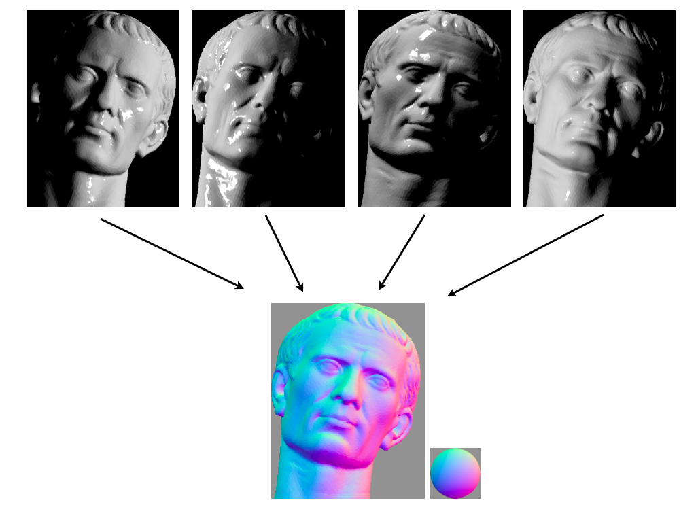

# Photometric Stereo

*This topic is a work in progress and will look very unfinished.*

[Photometric stereo](https://en.wikipedia.org/wiki/Photometric_stereo) is a technique in computer vision for estimating the surface normals of objects by observing that object under different lighting conditions. It is based on the fact that the amount of light reflected by a surface is dependent on the orientation of the surface in relation to the light source and the observer.[1] By measuring the amount of light reflected into a camera, the space of possible surface orientations is limited. Given enough light sources from different angles, the surface orientation may be constrained to a single orientation or even overconstrained.  

## Methods

### Child Information

For topics which need to break down  even further, IE specific details about feature detection.  
If this information block gets too busy its best split into its own page.

## Applications

## Software

Please list any software here.  
There can be comparison charts for features however there must be zero bias in this  
Any and all bias will be removed.

**Dabarti Capture** ([https://dabarti.com/capture/](https://dabarti.com/capture/))   
**Realtime Photometric Stereo** ([https://github.com/NewProggie/Realtime-Photometric-Stereo](https://github.com/NewProggie/Realtime-Photometric-Stereo))

## Hardware

### Data Acquisition

## Resources

[Calibration Based Photometric Stereo | Photometric Stereo](https://www.youtube.com/watch?v=os42t1Jb9IA)

## See Also

Is the subject similar to another, but not linked directly in this page?  
Please link to any other topics that may be similar that people would want to read more on

## References

Any references made in this can be cited here and linked.  
We do not mind links to blogs or youtube videos, as a lot of topics in this field are uncovered by trial and error, so we can expect a lot of community sourced information to come in this form.